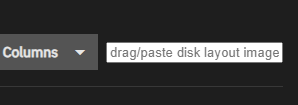
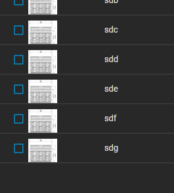
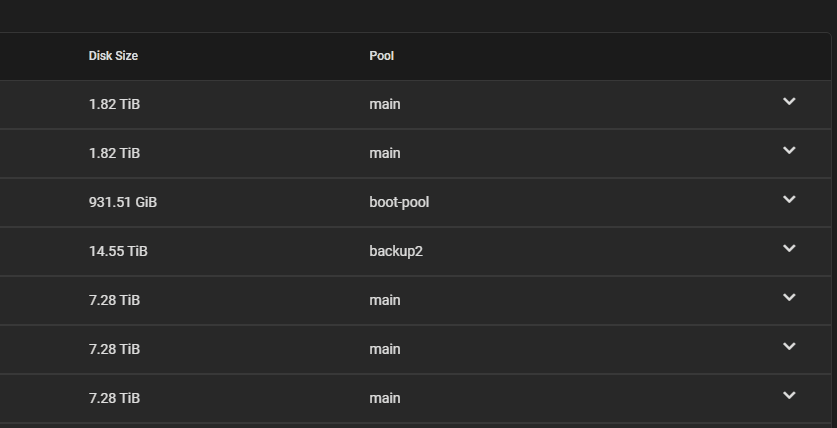

# Tampermonkey setup
1. install for the corresponding browser:
https://www.tampermonkey.net/
2. then on your trueNas website use the tampermonkey extension to "Create a new script"
3. copy [tampermonkey-script.js](tampermonkey-script.js) as the new script
4. (probably neccessary to adjust the @match part (in line 7) for your current url)

# How it works:

1. go to /ui/storage/disks
2. copy an image of your disk layout into clipboard, select the newly created  "layout image" input field
3. the image will be appearing next to each disk entry   
4. (if there are multiple images click on the small preview on the left to toggle between them)
5. click 2 times on the image on the right side 
    1. first for top left corner
    2. then for bottom right corner (so the green preview fits)  
    3. after the 2nd click it will be stored
6. to clean the ui up a bit you can replace 
   1. `let editmode = true;` with `let editmode = false;`
